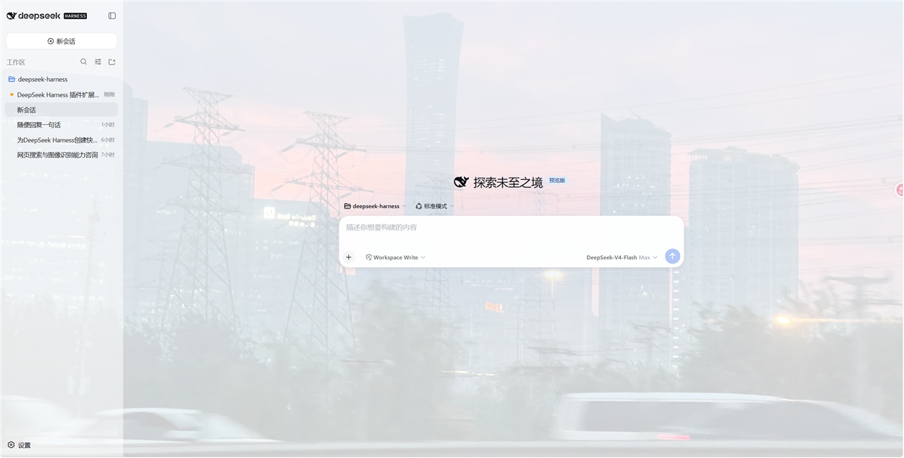
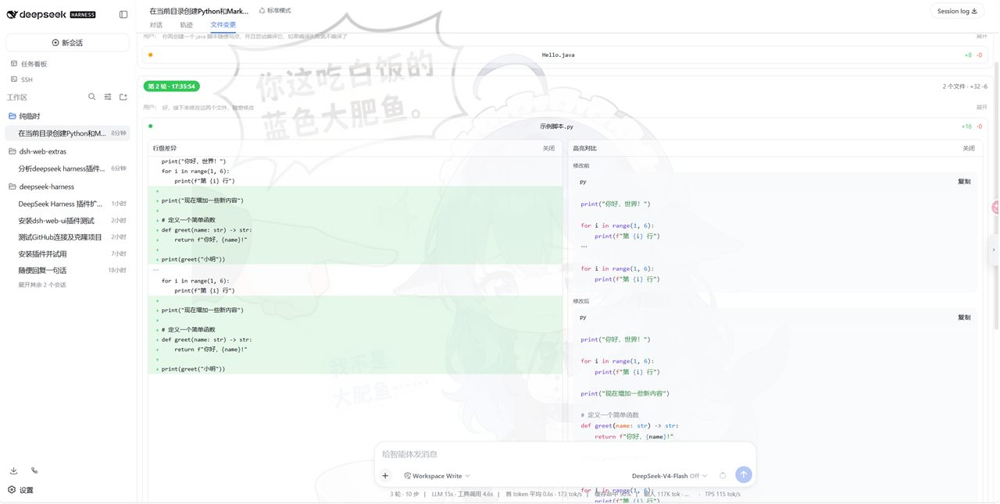
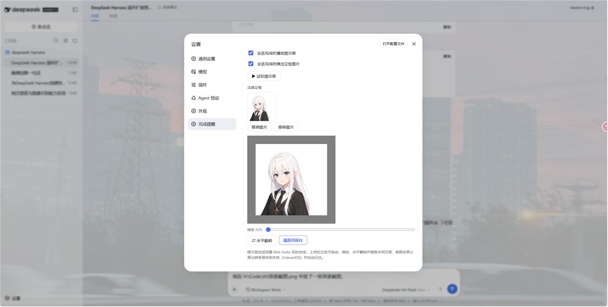
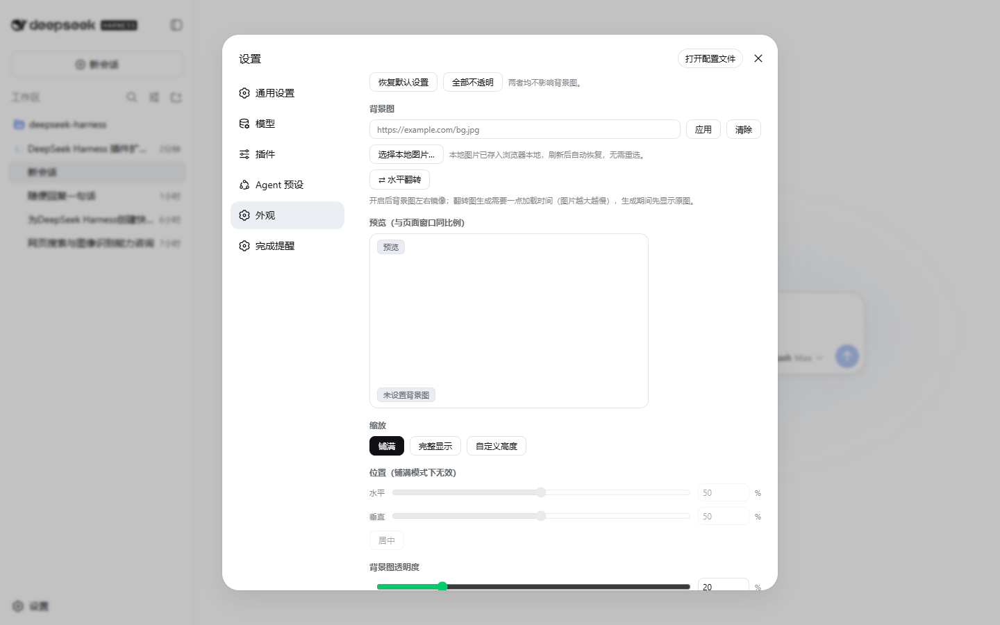

# dsh-web-extras


DeepSeek Harness Web 界面增强插件（bundle），包含三个功能：

1. **完成/审批/提问提醒**：会话完成、会话中的工具申请权限（等待审批）、或 AI 向你提问（等待回答）时，播放提示音（三种事件音效各不相同，可开关/试听），并可弹出立绘图片（支持上传/裁剪/翻转）。
2. **外观定制**：背景图（URL / 本地图片 + 水平翻转 + 预览 + 缩放 + 位置 + 透明度）、侧边栏/气泡/输入区/代码块透明度、输入区失焦折叠。
3. **文件变更**：按「轮次」聚合 AI 通过 write / edit / str_replace_editor 修改过的文件；每个文件可分别查看「行级差异」（增行绿色、删行红色）与「修改前/修改后代码高亮」，两种视图可同时打开、左右对比，也可分别关闭。

纯浏览器端实现（client 插件），无 Host 侧代码；所有配置与图片数据保存在本地浏览器，不经过任何服务器。



## 安装

要求：已安装 DeepSeek Harness CLI，并使用 Web 界面（`dsh --profile web`）。任选一种方式安装后，**重启 dsh 并刷新浏览器页面**即可生效。

### 方式一：GitHub（源码安装，自动构建）

```sh
dsh plugin --profile web add github:LimBoo233/dsh-web-extras
```

首次安装时 pnpm 会要求允许构建脚本（pnpm ≥ 10）。若失败，按提示把包名加入 profile 的 `pnpm-workspace.yaml` 的 `allowBuilds` 后重试：

```yaml
allowBuilds:
  dsh-web-extras: true
```

> 这是对包内代码的信任授权：仅安装你信任来源的包，并建议固定 commit（`github:LimBoo233/dsh-web-extras#<sha>`）。

### 方式二：tarball

```sh
git clone https://github.com/LimBoo233/dsh-web-extras.git
cd dsh-web-extras
pnpm install
pnpm pack          # 生成 dsh-web-extras-<版本号>.tgz（当前 0.2.2；pack 会先自动构建 lib/）
dsh plugin --profile web add ./dsh-web-extras-0.2.2.tgz
```

### 卸载

```sh
dsh plugin --profile web remove dsh-web-extras
```

## 使用

安装后浏览器设置页会出现两个新入口，会话视图环中会新增一个页签：

- 设置 → **提醒设置**：三种提醒事件（会话完成 / 申请权限 / 向你提问）各自的提示音开关与立绘开关、逐个试听、立绘上传/替换/移除、拖动缩放 + 水平翻转 + 遮罩裁剪（高分辨率输出）；立绘意外消失时，点击「裁剪并保存」即可恢复。
- 设置 → **外观**：背景图 URL/本地图片、水平翻转、与窗口同比例的实时预览（拖拽定位、滚轮缩放）、缩放模式、位置、背景图透明度；展开「高级选项」可调侧边栏/气泡/输入区/代码块/文件变更卡片透明度与输入区折叠。
- 会话 → **文件变更**页签：按轮次展示文件变更列表；展开文件后可在「行级差异」和「高亮对比」两种视图间自由开关与并排对比。

提醒触发时机：

- 会话完成：任意会话从「运行中」转为「空闲」时（右下角弹出，6 秒自动消失，点击可关闭）。
- 申请权限：任意会话出现待审批的工具操作时（右下角弹出，10 秒自动消失，点击可关闭）。
- 向你提问：任意会话等待你回答 AI 的问题时（右下角弹出，10 秒自动消失，点击可关闭）。

三种事件播放不同的提示音（完成=上行双音、审批=急促三连音、提问=下行双音），共用同一张立绘图片，且每项都可在设置页分别开关。

文件变更页签只读取 DSH 会话快照中已有的 diff 展示数据（write / edit / str_replace_editor 的结果视图），不产生新的网络请求，也不持久化任何数据。

## 变更日志

### v0.2.2

- 修复：文件卡片关闭「行级差异」或「高亮对比」任一视图后，文件体顶部会出现对应的「打开…」按钮，可随时重新打开，不再出现无法恢复的死胡同。
- 优化：「打开…」重开栏按钮水平居中，并压缩竖向占用空间。

### v0.2.1

- 新增「文件变更」效果预览截图（已压缩）；docs 目录仅保留在仓库中用于 GitHub 展示，不随发布包分发。

### v0.2.0

- 新增「文件变更」会话页签：按轮次聚合 write / edit / str_replace_editor 的修改，最新轮次置顶，彩色标签区分轮次，并展示每轮用户消息（可展开）。
- 文件卡片提供「行级差异」与「修改前 / 修改后高亮对比」两种可独立开关的视图，可并排对比。
- 「文件变更卡片透明度」移至 设置 → 外观 → 高级选项，支持 0%–100% 滑块与数字输入。
- 外观设置页改为卡片式排版：缩放 / 位置 / 背景图透明度合并为一张卡片，高级选项中除输入区折叠外的透明度设置合并为「界面透明度」卡片。
- 提醒设置页新增提示：立绘意外消失时，点击「裁剪并保存」即可恢复。

## 效果预览

**文件变更页签**（按轮次分组、彩色标签、用户消息、行级差异与高亮对比）：



**提醒设置页**（三种事件卡片 + 逐个试听 + 立绘上传/裁剪/翻转）：



**外观设置页**（背景图 + 实时预览 + 透明度/折叠）：



## 数据与隐私

| 数据 | 存储位置 | 说明 |
|---|---|---|
| 提醒设置 | localStorage `dsh-ntfy-config` | 完成/审批/提问的提示音与立绘开关 |
| 立绘图片内容 | IndexedDB `dsh-ntfy-store` | 上传/裁剪后的图片，刷新后自动恢复 |
| 外观设置 | localStorage `dsh-styl-config` | 全部数值与开关 |
| 本地背景图片内容 | IndexedDB `dsh-styl-store` | 刷新后自动恢复，无需重选 |
| 文件变更页签 | 无持久化 | 仅实时读取会话快照中的 diff 数据 |

全部数据仅存于本浏览器，清除浏览器数据（或更换浏览器/电脑）后丢失；插件不含任何网络请求，提示音由 Web Audio 实时合成，不依赖音频文件。

## 兼容性说明

- 背景图**水平翻转**对本地图片无限制；对 URL 图片要求图片服务器允许跨域读取（CORS），否则自动降级为原图并在设置页提示。
- 浏览器无法读取本地文件的真实路径，因此「记住图片」通过把图片内容存入 IndexedDB 实现，效果等同免重选。

## 开发

```sh
pnpm install
pnpm build        # 生成 lib/index.js（Node 半）+ lib/client.js（浏览器半）
```

构建用 esbuild，自包含、不依赖 DeepSeek Harness 源码仓库。浏览器 bundle 格式与官方 client 插件一致（`window.__ModuleLoader__.load` factory + 平台模块 external）。

## 许可证

MIT